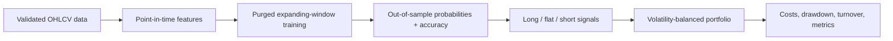

# AetherDrift Atlas

`AetherDrift Atlas` is a separate, enhanced research project built from the foundations of `AetherDrift`. It evaluates forecast quality and backtests a cost-aware portfolio across equities, ETFs, crypto, FX, and commodities.

It is for research and paper-trading workflows—not investment advice or a production execution system. Historical results and directional accuracy do not establish future performance.



## What is improved

- Multi-asset support with explicit conventions for equity, ETF, crypto, forex, and commodity instruments.
- Walk-forward validation with an embargo between a training window and test window, reducing label overlap and time-series leakage.
- Nested, cost-aware confidence-threshold selection: the threshold is fitted only inside each previous training window and is never chosen on its corresponding outer test period.
- Probabilistic direction forecasts with reported accuracy, balanced accuracy, long precision/recall, Brier calibration score, ROC-AUC, signal hit rate, and trade rate.
- A portfolio backtester that applies transaction costs, slippage, turnover, maximum per-asset weights, gross-exposure limits, inverse-volatility balancing, equity curves, drawdown, Sharpe, Calmar, and gross-versus-net return attribution.
- Two transparent baselines: a same-exposure long-only benchmark that tests directional skill fairly, and a separate full-exposure long-only market reference.
- A predeclared research gate that rejects weak candidates before any paper-trading consideration.
- A data and configuration fingerprint in every `summary.json`, so results can be reproduced and compared without silently changing the dataset or experimental setup.
- Download caching, normalized OHLCV validation, a deterministic offline demo, CSV artifacts, a JSON run summary, and automated tests.

## Quick start

From [AetherDrift-Atlas](.) in PowerShell:

```powershell
python -m venv .venv
.\.venv\Scripts\Activate.ps1
pip install -e ".[dev]"
python -m aetherdrift_atlas --demo --output outputs/demo
pytest
```

The offline demo makes no network requests and writes predictions, executed weights, portfolio history, and a `summary.json` file into `outputs/demo`.

## Run live research

Yahoo Finance symbols are passed directly, so the same command can mix markets:

```powershell
python -m aetherdrift_atlas `
  --symbols AAPL MSFT BTC-USD EURUSD=X GLD `
  --asset-classes equity equity crypto forex etf `
  --start 2018-01-01 `
  --output outputs/multi_asset
```

Use `--refresh` to replace the cached data for a request. The provider adapter is intentionally isolated in `src/aetherdrift_atlas/data.py`, so a broker or institutional feed can replace Yahoo Finance without modifying the research, validation, or accounting layers.

For predeclared equity, crypto, FX, commodity, and cross-asset test baskets, use [run_asset_research.ps1](examples/run_asset_research.ps1). It gives every basket a separate output directory so results remain comparable and do not overwrite each other.

## How the accuracy and backtest align

At decision timestamp `t`, Atlas computes features from information available through `t`. It predicts the direction of the forward close-to-close return `t → t+1` and stores that realized return at `t` as `target_return`. The portfolio therefore consumes each signal against its explicitly aligned forward return; it never trades on a return from the same already-observed bar.

The model is retrained for every expanding validation window. No final held-out period is blended into training, and the configured one-bar embargo prevents a training label from crossing the test boundary. Confidence thresholds are selected from an earlier nested validation slice and reused for the next outer folds, so the reported test window cannot influence the choice. Accuracy is reported only from these out-of-sample forecasts.

`summary.json` also includes a `research_gate`. By default, a candidate must show at least one ROC-AUC of 0.52, a net Sharpe of 0.5, a drawdown no worse than 25%, at least 60 signals, and a return higher than the same-exposure long-only baseline. A rejection is the expected and useful result for a model that lacks credible evidence.

## Reading portfolio comparisons

`gross_total_return` is the result before simulated costs, while `total_return` is after transaction cost and slippage assumptions. Their difference is `cost_drag_total_return`. `estimated_total_cost_dollars` converts the daily cost deductions to approximate portfolio dollars.

The `same_exposure_long` benchmark uses the model strategy's exact absolute position weights each day, but is always long. It makes the right comparison for deciding whether the model's long/short calls add value. `full_exposure_long` is only a broader market reference; it can be more invested than the model strategy and should not be used as a like-for-like directional benchmark.

## Project layout

```text
AetherDrift-Atlas/
├── src/aetherdrift_atlas/
│   ├── assets.py       # Asset categories and annualization conventions
│   ├── data.py         # Yahoo adapter, normalization, CSV caching
│   ├── features.py     # Point-in-time features and labels
│   ├── model.py        # Direction model and accuracy metrics
│   ├── walkforward.py  # Embargoed expanding validation
│   ├── backtest.py     # Multi-asset portfolio accounting
│   └── cli.py          # Reproducible command-line workflow
├── tests/              # Offline regression tests
└── pyproject.toml      # Installable package and dependencies
```

## Recommended next enhancements

1. Add an independent data source and reconciliation checks before relying on any live signal.
2. Add explicit momentum and mean-reversion strategy baselines alongside the long-only references, then test across multiple market regimes.
3. Add a paper-trading adapter with broker-specific market calendars, fractional-sizing rules, and order-fill reconciliation before considering live execution.
4. Track experiments in an immutable run registry, including data version, feature set, seed, configuration, and code revision.
